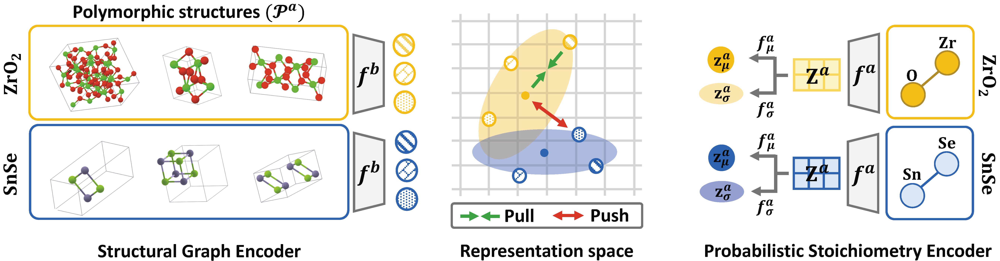

# Stoichiometry Representation Learning with Polymorphic Crystal Structures

The official source code for **[Stoichiometry Representation Learning with Polymorphic Crystal Structures](https://openreview.net/forum?id=DBiWSzlaGz)**, accepted at [NeurIPS 2023 workshop on AI for Scientific Discovery: From Theory to Practice (AI4Science)](https://ai4sciencecommunity.github.io/neurips23.html).

## Overview
Despite the recent success of machine learning (ML) in materials science, its success heavily relies on the structural description of crystal, which is itself computationally demanding and occasionally unattainable. Stoichiometry descriptors can be an alternative approach, which reveals the ratio between elements involved to form a certain compound without any structural information. However, it is not trivial to learn the representations of stoichiometry due to the nature of materials science called polymorphism, i.e., a single stoichiometry can exist in multiple structural forms due to the flexibility of atomic arrangements, inducing uncertainties in representation. To this end, we propose PolySRL, which learns the probabilistic representation of stoichiometry by utilizing the readily available structural information, whose uncertainty reveals the polymorphic structures of stoichiometry. Extensive experiments on sixteen datasets demonstrate the superiority of PolySRL, and analysis of uncertainties shed light on the applicability of PolySRL in real-world material discovery.

</img> 

**Overall model architecture. While the structural graph encoder obtains a deterministic structural representation of crystal, the probabilistic stoichiometry encoder learns to represent each stoichiometry as a parameterized probabilistic distribution by acquiring mean and diagonal covariance matrices.Both encoders are jointly trained with soft contrastive loss in representation space.**

## Requirements
```
- Python 3.7.1
- Pytorch 1.8.1
- torch-geometric 1.7.0
- pymatgen 2022.0.17
- mendeleev 0.7.0
```

## Data Preparation

### Training dataset
We build training dataset consists of the materials and its properties which are collected from [Materials Project](https://materialsproject.org/).
We converted raw files to `mp.pkl` file and made create training data with `build_train_data.py` file.


### Test dataset

**[Step 1]** Download test datasets as given in the Table.

|Dataset | URL  |
|---|---|
|Band Gap | [Predicting the band gaps of inorganic solids by machine learning](https://pubs.acs.org/doi/10.1021/acs.jpclett.8b00124) |
|Formation Entalphies | [Experimental formation enthalpies for intermetallic phases and other inorganic compounds](https://figshare.com/collections/Experimental_formation_enthalpies_for_intermetallic_phases_and_other_inorganic_compounds/3822835)|
|Metallic | [Machine Learning Materials Datasets](https://figshare.com/articles/dataset/MAST-ML_Education_Datasets/7017254)  |
|ESTM 300 K & 600 K| [A public database of thermoelectric materials and system-identified material representation for data-driven discovery](https://www.nature.com/articles/s41524-022-00897-2)  |
|Matbench Datasets| [Benchmarking materials property prediction methods: the matbench test set and automatminer reference algorithm](https://github.com/anthony-wang/CrabNet/tree/master/data/matbench_cv)  |


**[Step 2]** Preprocess the downloaded datasets with `build_test_data.py` file.

## How to Run the Code


### To train the model

**[Option 1]** Train model with shell script
```
sh ./sh/train_PolySRL.sh
```

**[Option 2]** Train model without shell script

```
python train.py
```

Following hyperparameters can be passed to `train.py`

`--lr`: Learning rate for training PolySRL. Default is 5e-05.

`--hidden dim`: Hidden dimension in encoders. Default is 200.

`--epochs`: Total epochs for training PolySRL. Default is 100.

`--batch_size`: Batch size (Number of materials) for training PolySRL. Default is 256.

`--no_node_feature`: Choose not to use additional node features for crystal structural graph. If set to `True`, model will not use the additional feature. 
Throughout all our experiments, we deliberately avoid the use of any extra node features to exclusively assess the benefits of employing structural information.
Default is True. 

`--n_samples`: Number of samples from latent distribution of stoichiometry ($J$ in Equation 4). Default is 8.

`--negative scale` : Initial value for learnable parameter for scaling Euclidean distance ($c$ in Equation 4). Default is 20.

`--shift`: Initial value for learnable parameter for shifting Euclidean distance ($d$ in Equation 4). Default is 20. 

`--vib`: Controls the weight of KL divergence loss ($\beta$ in Equation 6). Default is 1e-08.

`--grad_clip`: Whether to clip gradients for more stable training of PolySRL. Default is True.

### To test the model

We provided trained weights for PolySRL and baseline methods in `model_checkpoints/` directory.

**[Option 1]** Test model with shell script

```
sh ./sh/test_PolySRL.sh
```

**[Option 2]** Test model without shell script

```
python test_representation.py
python test_transfer.py
```